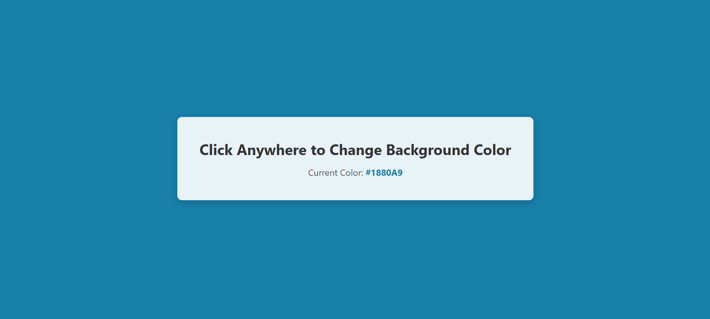

# Toggle Background Color

A simple and interactive web application that changes the background color of the page with every click. Built with HTML, CSS, and JavaScript.

## Features
- Changes the background color to a random hex color on every click.
- Displays the current background color in hex format.
- Smooth transition effect for color changes.
- Responsive design that works on all screen sizes.

## Preview
Here’s how it looks:

 

- The page starts with a white background.
- Click anywhere on the page to see the background color change.
- The current color code is displayed in the center of the page.

## How It Works
1. When the user clicks anywhere on the page, a JavaScript event listener triggers the `changeBackgroundColor` function.
2. The `getRandomColor` function generates a random hex color code.
3. The background color of the page is updated to the new color, and the current color code is displayed on the screen.
4. The CSS transition property ensures the color change is smooth and visually appealing.

## Technologies Used
- **HTML**: Structure of the page.
- **CSS**: Styling and animations.
- **JavaScript**: Logic for generating random colors and updating the DOM.

## Customization
- **Change Fonts**: Update the `font-family` in the `style.css` file.
- **Adjust Transition Speed**: Modify the `transition` property in the `body` selector in `style.css`.
- **Add More Colors**: Customize the `getRandomColor()` function in `script.js` to use a predefined palette.

## Contributing
Contributions are welcome! If you'd like to improve this project, follow these steps:
1. Fork the repository.
2. Create a new branch (`git checkout -b feature/your-feature`).
3. Commit your changes (`git commit -m 'Add some feature'`).
4. Push to the branch (`git push origin feature/your-feature`).
5. Open a pull request.

---

Enjoy playing with colors! 🎨